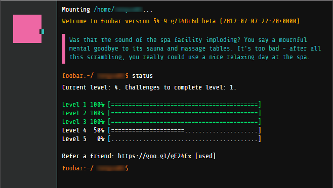

# google-foobar

These code challenges are from Google foobar.

Each directory contains a problem and the directories are numbered in the order of the challenges (ie: 2.1 -> level 2 problem 1).

The `readme` files have the story line and describe the problem followed by my attempts at a solution.

Solutions are implemented in java 7 (per requirement). I also included a runner for easy testing/verification.

To run any of the solutions just go to the directory is execute:

`"[java_path]\bin\javac.exe" Runner.java Solution.java && "[java_path]\bin\java.exe" Runner`
